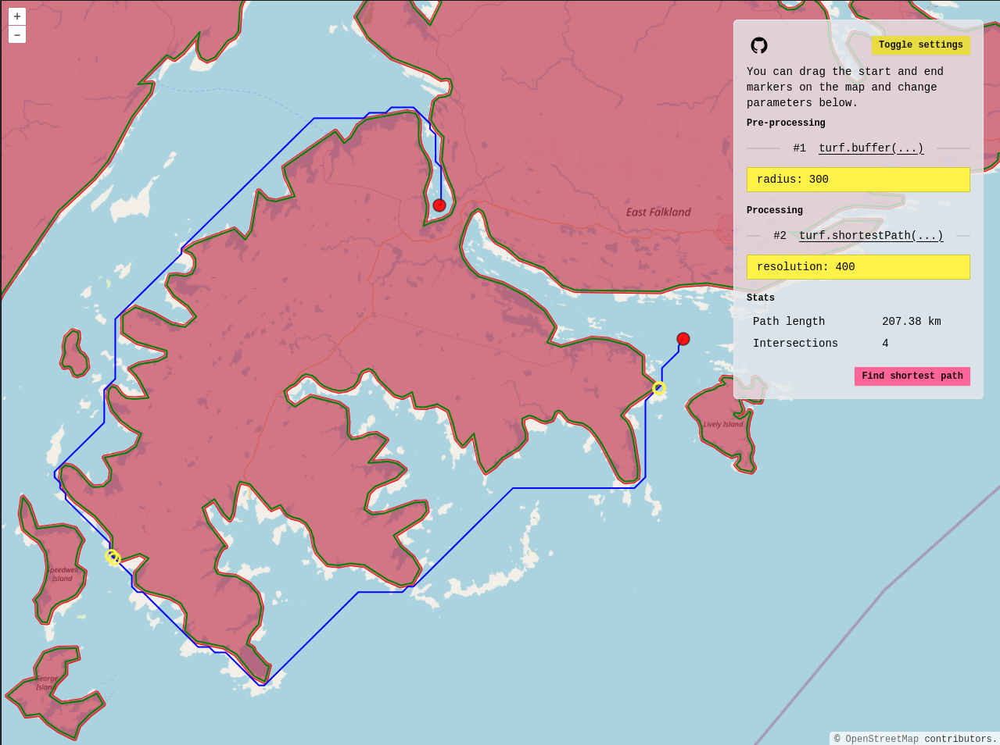

# Shortest path experiment

Experiment with different "shortest path" libraries. Try it out at https://experiment-shortest-path.pages.dev/.

[Open in CodeSandbox](https://githubbox.com/orbat-mapper/experiment-shortest-path)

Screenshot:

Libraries used:
- [OpenLayers](https://openlayers.org/) for drawing the map
- [Turf.js](https://turfjs.org/) for geometry calculations

## Getting started

Clone repo:

    $ git clone https://github.com/orbat-mapper/experiment-shortest-path.git

Navigate to project root:

    $ cd experiment-shortest-path

Install dependencies:

    $ npm install

To start a development server run:

    $ npm run dev

The demo is now running on http://localhost:5173/. 
